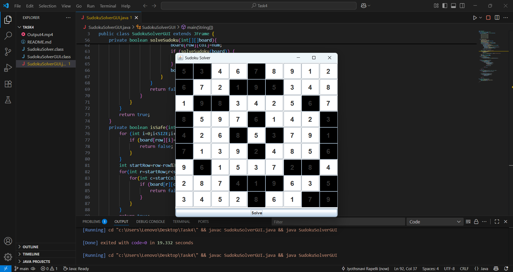

# PRODIGY_SD_04
The project Sudoku Solver using Java with GUI is developed to solve Sudoku puzzles automatically using the backtracking algorithm. Sudoku is a logic-based puzzle where a 9×9 grid must be filled so that every row, column, and 3×3 subgrid contains numbers from 1 to 9 without repetition. In this project, Java Swing is used to design the graphical interface, which displays the Sudoku board as a grid of text fields. Predefined numbers are fixed and shown in non-editable cells, while empty cells are solved by the program. When the user clicks the “Solve” button, the algorithm checks possible numbers for each empty cell, places them if valid, and backtracks when conflicts occur until the puzzle is solved. If a solution exists, the full grid is displayed; otherwise, a message notifies the user. This project effectively combines algorithms with GUI programming and can be extended with features like puzzle generation, difficulty levels, and hints.

